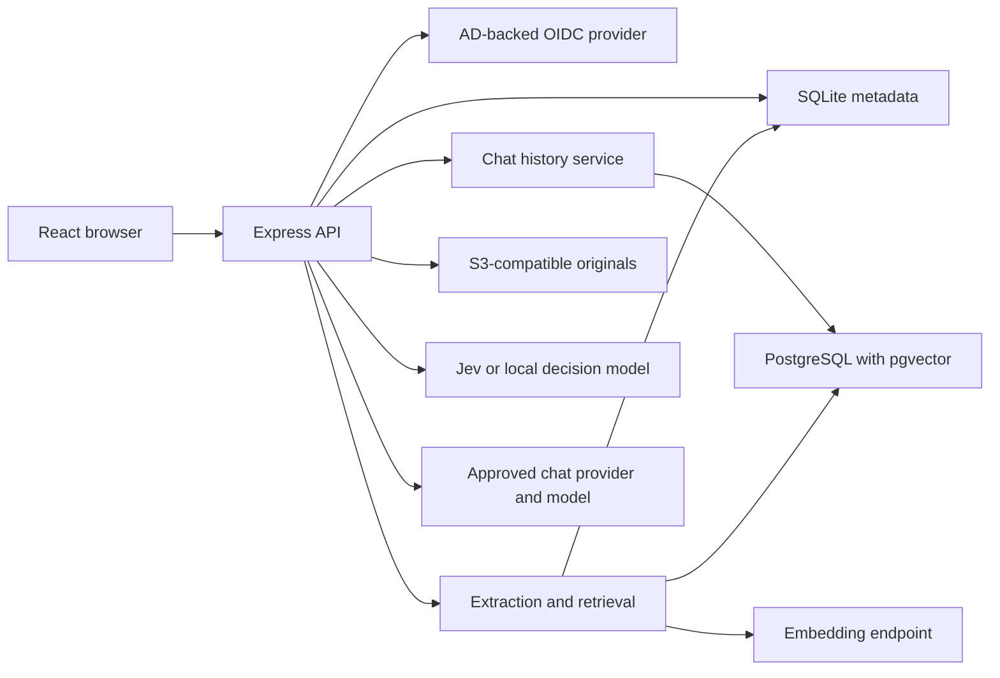

# Raazi architecture

Updated: 6 October 2026. Read this file with [HANDOFF.md](HANDOFF.md) before continuing development.

## Product and scope

Raazi is an SNGPL-branded enterprise chat and knowledge workspace. Raazi is the default displayed platform name. Administrators can change it under Administration > Platform.

The application uses React and TypeScript in the browser. Express and TypeScript run on Node.js. The earlier Python/Flask implementation is retained in Git history only. Python, make, and g++ support native Node dependency installation in the reusable runtime image; Node runs the application.

The image builder fetches Debian packages over HTTPS. If the slim base lacks an APT CA bundle, it seeds one from Node's bundled public roots before installing system CA certificates. TLS and Debian signature verification remain enabled. This avoids HTTP metadata interception but does not authenticate to an organizational proxy.

Users can ask an approved chat model, attach private files, search permitted knowledge repositories, and enable an optional decision model. Admins configure providers, models, embeddings, S3 storage, repository permissions, and user profiles.

## Components

| File or folder                 | Responsibility                                                            |
| ------------------------------ | ------------------------------------------------------------------------- |
| `client/main.tsx`              | Session, page state, drafts, chat requests, and fixed composer            |
| `client/Sidebar.tsx`           | History, search, pinned chats, folders, and mobile drawer                 |
| `client/MessageView.tsx`       | Safe Markdown, citations, copy, question edit, and resend                 |
| `client/PaletteSettings.tsx`   | Persisted accent, composer shade, and composer size                       |
| `client/Admin.tsx`             | Admin tabs and default model settings                                     |
| `client/ModelProviders.tsx`    | Provider CRUD, discovery, approved models, and routing settings           |
| `client/StorageForm.tsx`       | S3 configuration and bucket test                                          |
| `client/public/sngpl-logo.png` | Bundled SNGPL brand asset; see [BRANDING.md](BRANDING.md)                 |
| `server/app.ts`                | HTTP API, authentication, authorization, and chat orchestration           |
| `server/routing.ts`            | Provider catalog, model selection, discovery, Jev/local decision adapters |
| `server/knowledge.ts`          | PDF/DOCX/text extraction, chunks, embeddings, shared retrieval            |
| `server/attachments.ts`        | Private uploads, image validation, indexing, and private retrieval        |
| `server/storage.ts`            | S3-compatible originals, version references, and bucket tests             |
| `server/history.ts`            | Private chat history, folders, revisions, SQLite/PostgreSQL persistence   |
| `server/db.ts`                 | SQLite migrations and credential encryption                               |
| `server/index.ts`              | Environment configuration and HTTP server lifecycle                       |
| `shared/`                      | Shared types and appearance options                                       |
| `tests-ts/`                    | Isolated API, storage, identity, PostgreSQL, and Edge browser fixtures    |

Run from the repository root. The application reads `server/schema.sql` and `server/uploads-schema.sql` there.

## Service layout

PostgreSQL is optional in development. One pgvector container is sufficient for history and vectors. A separate vector database is not required.

## Data ownership

| Store                                               | Data                                                                                                                                                                                   |
| --------------------------------------------------- | -------------------------------------------------------------------------------------------------------------------------------------------------------------------------------------- |
| SQLite, normally `data/raazi.db`                    | Users, profiles, preferences, settings, provider catalog, routing configuration, repository permissions, extracted passages, source references, attachment metadata, and audit entries |
| SQLite without configured PostgreSQL                | Chat history and local exact vector search; FTS keyword search when embeddings are off                                                                                                 |
| PostgreSQL                                          | Private history tables `raazi_chat_*` and dimension-specific HNSW vector tables `raazi_vectors_<dimensions>`                                                                           |
| S3-compatible object store                          | Original uploaded documents and images, with stored object references and versions                                                                                                     |
| Local encryption key or configured `ENCRYPTION_KEY` | Key needed to decrypt saved model, provider, and S3 credentials                                                                                                                        |

The SQLite `vector_namespace` identifies the workspace in PostgreSQL. Preserve it when moving PCs or restoring stores. An empty SQLite database against an existing PostgreSQL service creates a different workspace and can make history appear missing.

New uploaded originals use S3. Legacy or programmatically added repository documents can still contain originals in SQLite. Private uploads do not become shared repository documents.

`CHAT_DATABASE_URL` overrides history storage. When unset, history uses `VECTOR_DATABASE_URL`. An explicitly empty chat URL selects SQLite history. Configured PostgreSQL failure produces an error; it does not switch to local storage. Initial PostgreSQL startup imports retained SQLite history once. That local copy is then a stale snapshot.

## Chat request flow

1. Validate the session, CSRF token, request, and conversation ownership.
2. Resolve the selected or default model from approved, enabled chat models.
3. Read recent history and validate selected private files.
4. Check the selected repository against user access.
5. If requested, run the decision layer.
6. Retrieve private document passages. Retrieve shared passages when required.
7. Build model context from the system prompt, profile, permitted sources, recent history, question, and supported images.
8. Call the selected provider's `/chat/completions` endpoint.
9. Recheck the session and save the exchange.
10. Display formatted Markdown, source links, and response tools.

Requests use non-streaming responses. Chat requests time out after 120 seconds. Model discovery uses authenticated `GET /models` and a 15-second timeout. No provider calls are needed to start the UI.

Model display names are optional labels. The default connection stores `display_name` and `thinking_control` in SQLite settings. Providers store these values per approved model in `model_options`. Model keys and actual inference IDs remain unchanged. Blank display names retain the original labels.

The composer Thinking switch starts off after reload. Configured models send `chat_template_kwargs.enable_thinking` or `chat_template_kwargs.thinking` as a boolean. Models with no configured control use the engine default and send no extra parameter. Decision routing applies the preference to the final selected chat model, when supported. It does not control the decision model.

`shared/thinking.ts` separates `reasoning_content`, `reasoning`, and leading `<think>...</think>` blocks from answer text. Ordinary prose and code remain intact. Reasoning-only responses fail without saving an exchange. SQLite and PostgreSQL history add a `reasoning` text column without replacing existing data. Saved legacy tagged replies are separated on read. Prior context and decision requests include only answer text. Replies show reasoning as escaped text under a collapsed Thinking icon; answer copy excludes it. Reasoning is stored with the private chat and has the same access checks. Raazi displays only reasoning supplied by the external model.

Question edit/resend saves only after successful inference. A revision checks the saved version and tail message. It replaces the edited question and later replies atomically. Concurrent changes return a conflict rather than overwrite another request.

The reply disclosure is labelled **Thoughts** and is closed by default. Reasoning extraction also accepts a standalone `</think>` line when a model template has prefilled the opening tag. Closing tags inside fenced code remain answer content. This applies to new replies and saved history. Unmarked prose cannot be reliably classified as reasoning.

## Decision routing

The user switch beneath the composer starts off after reload. Admins enable routing and choose a decision provider, model, confidence threshold, and optional default chat model.

TypeSafe uses `POST /systemone`. Two choice questions select the action and target. The local adapter uses OpenAI-compatible chat completion with a validated JSON response. The [admin guide](ADMIN_GUIDE.md) defines its response contract.

Permitted actions are direct answer, knowledge retrieval, or clarification. Candidates come from enabled, approved chat models. TypeSafe models and local decision-only providers do not appear as chat candidates. Image requests use only image-capable candidates. A decision request supports at most 200 chat candidates.

The lower of action and target confidence must meet the threshold, initially 0.80. Otherwise, Raazi saves a clarification without calling a chat model. Malformed output, unknown choices, invalid distributions, or a service failure stop the request without changing history.

The decision provider receives the question, up to ten recent messages, and filenames. It receives no image bytes, enterprise profile, or retrieved passages in that decision call. Recent message text can itself contain enterprise information.

Explicit repository selection and private attached documents keep knowledge retrieval active. The router cannot expand repository access. The saved answer includes the route, selected model, and confidence.

This layer does not execute business actions, tools, or external workflows.

## Knowledge and source flow

PDF extraction preserves physical page numbers. DOCX extraction preserves paragraph, table, and section labels; it does not invent PDF-style page numbers. TXT and Markdown use text labels.

Chunks retain source IDs. Embeddings use an admin-configured endpoint, model, and dimensions. Without embeddings, retrieval uses keyword search. With embeddings but no PostgreSQL, vectors use local exact cosine search. A configured embedding failure does not silently use keyword search.

Repository access uses exact identity group IDs. Private attachments are scoped to their owner. Source and original-file routes check access again. PDF links include a page fragment. DOCX citations open the extracted excerpt and original file.

Scanned PDFs need OCR before upload. OCR is not implemented. Unreadable private documents retain their original and show unsupported status. Images require a vision-capable chat model; image knowledge indexing is not implemented.

## Identity and security

Authenticated JWT cookies contain a random session ID registered in SQLite `login_sessions`. Every authenticated request checks expiry, revocation, user binding, and account state. Development, Portal OTP, and OIDC logins register sessions; reauthentication rotates the browser's session. Logout revokes its server record. Disabling an account revokes all its sessions. Session records survive app restarts and expire after eight hours. Anonymous CSRF cookies and OIDC pending state are not registered login sessions. Pre-upgrade cookies without session IDs require a new sign-in; no workspace data is removed.

Administration → Sessions lists unexpired, unrevoked sessions with user/role, browser user-agent, sign-in, last activity, expiry, and current-browser indication. Only admins can list or revoke sessions. Single-session and all-user revocations require CSRF and write audit entries. No cookie, JWT, CSRF token, or provider credential is shown. Expired records older than 30 days are removed during login.

Activity reflects authenticated API/source requests, throttled to one timestamp update per 30 seconds. Recently active means within five minutes. Passive `/api/session` checks do not count as activity. The sessions panel refreshes every 30 seconds; each signed-in browser checks its login state every 30 seconds and handles unauthorized API responses. Revocation denies subsequent requests immediately. Existing inference can finish at the provider, but the save-time session check rejects its chat result after revocation. Terminating Raazi sessions does not terminate the enterprise identity provider's session or disable the user's account.

Production uses AD-backed OIDC through AD FS or Entra ID. It verifies signed tokens, issuer, audience, nonce, state, and PKCE. Direct LDAP and integrated Windows authentication are not implemented.

Mutations require CSRF. Users cannot access another user's history, private files, or sources. Repository groups control shared access. Group-overage expansion is not implemented.

Saved credentials use AES-256-GCM. Legacy Fernet values remain readable. The signing secret and encryption key have different purposes; preserve both. Database content other than saved credentials is not encrypted by the application.

Markdown omits raw HTML, sanitizes links, and does not fetch model-supplied remote images. Profiles and documents are treated as untrusted model context.

## UI decisions already agreed

- Chat history stays on the left, with search, pinned chats, and folders.
- Messages scroll independently. The composer stays visible at the bottom.
- Composer defaults to Compact, about half the former height. Comfortable and Spacious are available.
- Six workspace accent palettes and five light composer shades save per user.
- The model selector stays on the right of the composer.
- Upload uses **+**. Answers support copy; questions support edit and resend.
- An accuracy note stays beneath the composer.
- SNGPL branding is local and works without the external logo portal.

## Deployment and limits

Deployment configuration uses tracked `env.sample.qa` and `env.sample.prod` templates. Filled `.env.qa` and `.env.prod` files stay outside Git. The same Compose files serve both environments; `--env-file` selects configuration. Sample project names isolate each environment's named volumes. The supplied systemd unit selects QA.

PostgreSQL uses the external named volume `${COMPOSE_PROJECT_NAME}_postgres_data`, retaining the original Compose volume name. Compose does not create or delete this volume. Start/restart checks that it exists before stopping services. Explicit `prepare volumes` (also included in `prepare all`) creates a missing volume only when no existing PostgreSQL service container is present; otherwise it requires mount inspection. Existing volumes are preserved. Keep the project name stable. SQLite still uses the retained named `app_data` volume.

Before restart, the controller also compares existing PostgreSQL containers' data mounts with the expected external volume. A differing name or a bind mount stops the operation before teardown, so the change cannot silently attach a different data volume.

The Podman overlay declares both the project-scoped `default` bridge and the external inference network. Explicit declaration avoids `podman-compose` rejecting referenced networks during config parsing.

Restart dependency preflight uses a temporary `podman run --network none --pull=never` container. It mounts only read-only source and the project dependency volume, with no service IP, ports, application data, or secrets. This avoids a Compose one-off container inheriting the running app's fixed address. Shared SELinux labels allow the app and helper to read the same dependency volume.

`raazictl` controls Podman deployments, defaulting to QA. Only explicit `prepare` downloads pgvector, builds the reusable runtime image, or installs changed dependencies. The checkout is mounted read-only at `/app`; project-scoped dependency, compiled-output, and npm-cache volumes overlay it. Existing `app_data` and `postgres_data` names are preserved. Startup checks dependency hashes before compiling the mounted code. The controller runs the same check before restart teardown. Ordinary updates require no image rebuild. Old baked-code images are rejected with one-time migration instructions. Runtime Compose files contain no build recipe, and the Podman overlay forbids image pulls. Start/restart preflight checks local images, the inference network, and configuration. Stop preserves named volumes. Update fast-forwards the current Git upstream without changing services or environment files. Shell contract tests use mocked Podman and Git; Linux behavior still needs target-host verification.

Linux Podman uses `compose.production.yaml` plus `compose.podman.yaml`. Both services join Aigate's external `podnet10` network and the application network. QA selects fixed bridge addresses `.40` for Raazi and `.41` for PostgreSQL; the production sample selects `.42` and `.43`. The addresses are configurable through `RAAZI_APP_IP` and `RAAZI_POSTGRES_IP`. PostgreSQL is reachable on the shared bridge but has no host-published port. Models and S3 remain external services configured in the GUI. `docs/PODMAN.md` describes `/opt/rnd/raazi` setup and the root systemd unit.

Optional `AUTH_MODE=portal` uses `server/portal-auth.ts` and `client/PortalLogin.tsx` for Portal AD password validation followed by authenticator OTP. Challenges are process-local, session-bound, short-lived, and attempt-limited. Passwords and codes are not persisted. Explicit Portal administrator usernames determine roles. Portal responses do not establish verified group membership; new Portal users have empty groups. OIDC identities and Portal identities remain separate.

Use the supplied Dockerfile, production Compose file, environment example, and Nginx TLS example. Run one application replica. Local indexing locks and mutations do not support distributed workers. Keep the metadata volume, PostgreSQL, S3 objects, and encryption key together in backups.

Production deployment, live AD sign-in, Huawei S3 compatibility, and live Jev/model calls remain to be verified in the target environment. No OCR, streaming, quotas, durable indexing queue, automatic enterprise connectors, business action execution, or full PostgreSQL metadata migration is implemented.

## Screen-size support

The chat layout uses the available viewport height. Short laptop screens use a smaller welcome logo, less spacing, and compact suggestion cards. The composer, decision switch, and AI notice stay visible. Messages and overflow welcome content scroll above them. Narrow screens keep the history drawer. Browser checks cover desktop, laptop, tablet, phone, and landscape sizes.

Platform branding: Administration > Platform saves a display name (1-80 characters) in SQLite. Login, workspace labels, and browser title use this name. Signed-in pages refresh it within 30 seconds; reload login to see changes. Internal container names, storage, and keys stay unchanged. The SNGPL mark has no blue background.
